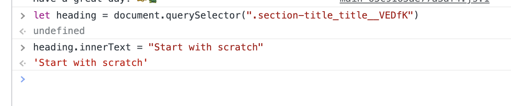

# Dom manipulation 

### Question-1

 Webiste Name: [Sony](https://www.sony.co.in/)

### Task
 change the button text To current Date.

 ### output

### Question-2

Webiste Name: [Vercel](https://vercel.com/)

### Task
change the heading “Start with the developer” to “Start with Scratch”

### output

### Question-3

Webiste Name:[Philips](https://www.philips.co.in/)

### Task
change the background colour blue to orange

### output

### Question-4

Webiste Name:[Oppo](https://www.oppo.com/in/)

### Task
      Change the description colour black to orange

### output

### Question-5

Webiste Name:[Canon](https://in.canon/)

### Task
      extract the canon logo

### output

### Question-6

Webiste Name:[Apple](https://support.apple.com/en-in)

### Task
Fetch all the product name and store in an array

### output

### Question-7

Webiste Name:[Google](https://www.google.com/)

### Task
       Remove  alternate Elements

### output

